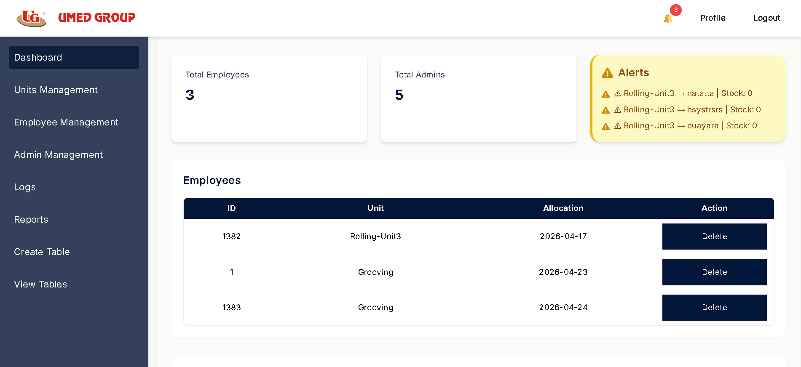
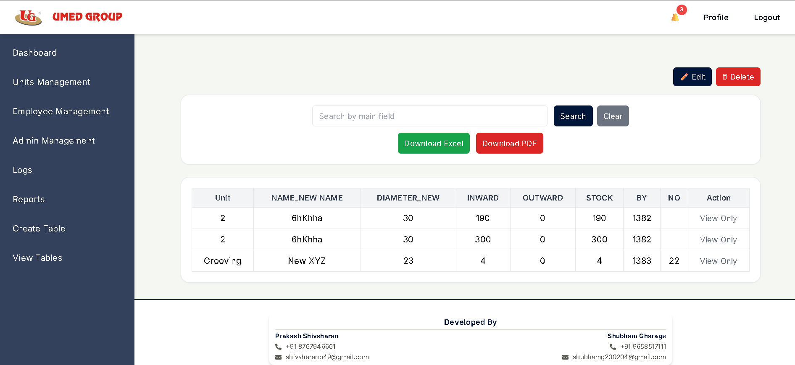
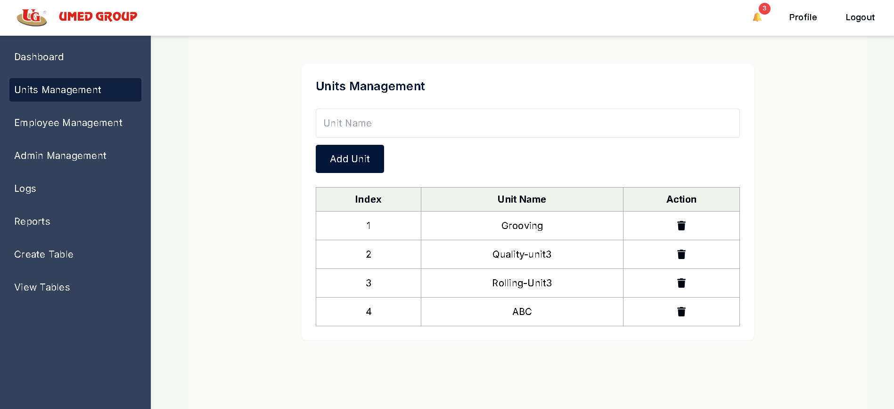
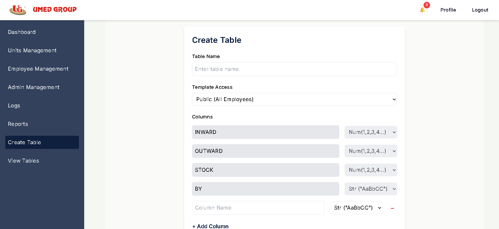
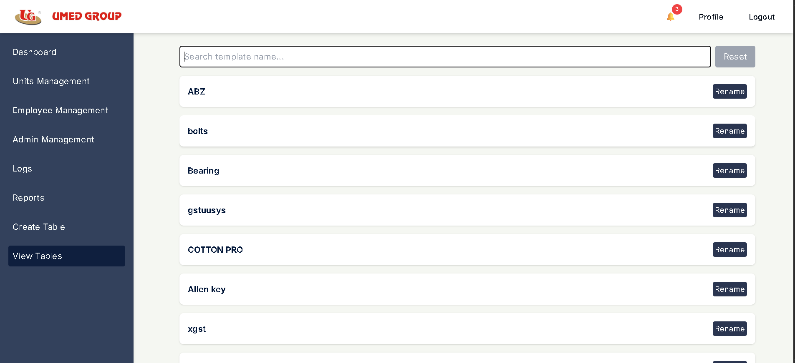
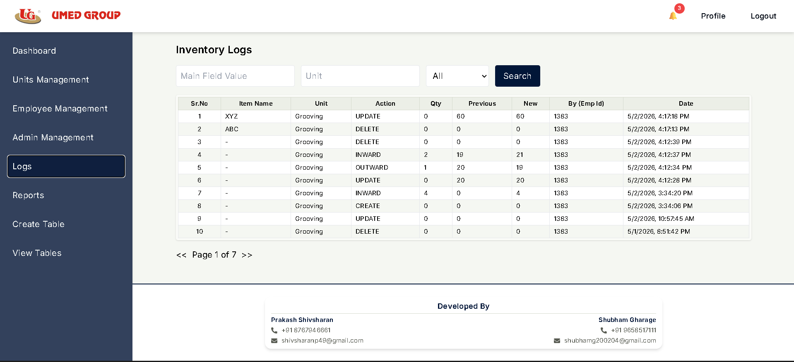
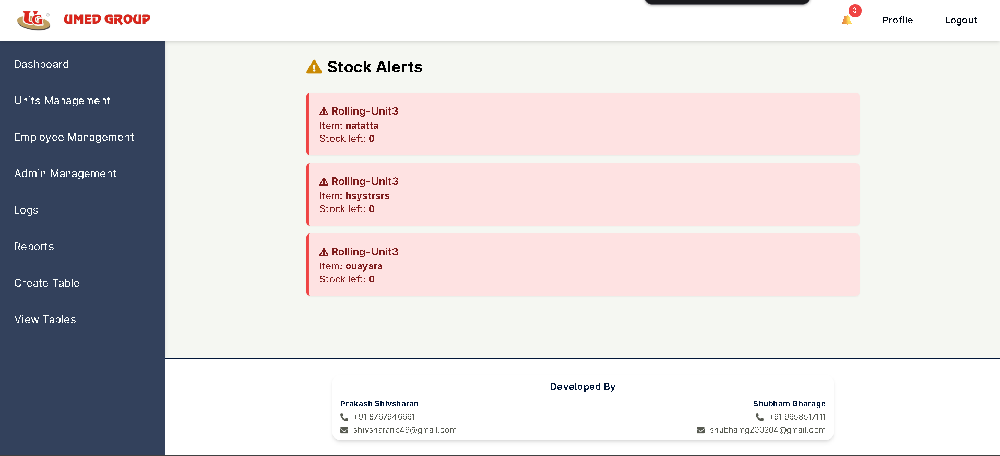

# UG Inventory Management System

## Overview
The **UG Inventory Management System** is a Spring Boot-based backend application designed to manage inventory templates, 
fields, and employee access. It provides RESTful APIs for creating, updating, retrieving, and deleting templates, as well 
as managing template fields and employee access.

---

## Features
- **Template Management**: Create, update, delete, and retrieve templates.
- **Field Management**: Add, rename, and retrieve fields for templates.
- **Employee Access Control**: Manage restricted templates and assign employees.
- **Pagination and Sorting**: APIs support pagination and sorting for efficient data retrieval.
- **Validation**: Ensures data integrity with custom validation rules.

---

## Technologies Used
- **Java**: Programming language.
- **Spring Boot**: Framework for building the backend.
- **Spring Data JPA**: For database interaction.
- **Hibernate**: ORM for managing entities.
- **Maven**: Build and dependency management tool.
- **SLF4J**: Logging framework.
- **Jakarta Validation**: For input validation.

---

## Project Structure
### Key Directories
- `src/main/java/online/umedgroup/ug_inventory_management/controllers`: Contains REST controllers for handling API requests.
- `src/main/java/online/umedgroup/ug_inventory_management/services`: Contains service classes for business logic.
- `src/main/java/online/umedgroup/ug_inventory_management/repositories`: Contains repository interfaces for database operations.
- `src/main/java/online/umedgroup/ug_inventory_management/models`: Contains entity classes representing database tables.
- `src/main/java/online/umedgroup/ug_inventory_management/common/dtos`: Contains Data Transfer Objects (DTOs) for API communication.

---

## API Endpoints
### Template Management
- **Create Template**: `POST /templates`
- **Get Templates**: `GET /templates`
- **Get Template by ID**: `GET /templates/{templateId}`
- **Delete Template**: `DELETE /templates/{templateId}`
- **Rename Template**: `PATCH /templates/{templateId}`

### Field Management
- **Get Fields by Template ID**: `GET /templates/{templateId}/fields`
- **Add Field to Template**: `PATCH /templates/{templateId}/add-field`
- **Rename Field**: `PATCH /templates/{templateId}/fields/{fieldId}`

### Employee Access
- **Get Employee Templates**: `GET /templates/employee/templates`
- **Update Template Access**: `PATCH /templates/{templateId}/access`

---

## Coding Standards and Practices
1. **Validation**:
    - All input data is validated using DTOs and custom validation rules.
    - Example: `@NotNull` annotations and custom exceptions for invalid data.

2. **Transaction Management**:
    - Service methods that modify data are annotated with `@Transactional` to ensure atomicity.

3. **Error Handling**:
    - Custom exceptions like `IllegalArgumentException` are used for meaningful error messages.

4. **Logging**:
    - SLF4J is used for logging important events and debugging information.

5. **Pagination and Sorting**:
    - APIs support pagination and sorting using `Pageable` and `Sort`.

6. **Code Modularity**:
    - Separation of concerns is maintained between controllers, services, and repositories.

7. **Default Fields**:
    - Fixed fields (`INWARD`, `OUTWARD`, `STOCK`, `BY`) are managed programmatically and cannot be modified by users.

8. **Database Queries**:
    - Custom queries are written using JPQL for complex operations.

---

## Setup Instructions
### Prerequisites
- Java 17 or higher
- Maven 3.8+
- MySQL or any compatible database


---


## Application Screenshots

### Dashboard
The main dashboard provides an overview of inventory operations, quick navigation, and system statistics.



---

### Material Management
Manage inventory materials efficiently with options for adding, updating, and tracking stock items.



---

### Unit Management
Allows administrators to manage measurement units used across inventory items.



---

### Table Creation
Dynamic table creation feature for customizable inventory templates and structures.



---

### View Tables
Displays all created inventory tables with management options.



---

### Logs Management
Tracks system activities and operations for monitoring and debugging purposes.



---

### Alert System
Provides alerts and notifications for important inventory events and actions.




---

### Steps
1. Clone the repository:
   ```bash
   git clone https://github.com/umedgroup/ug_inventory_management.git